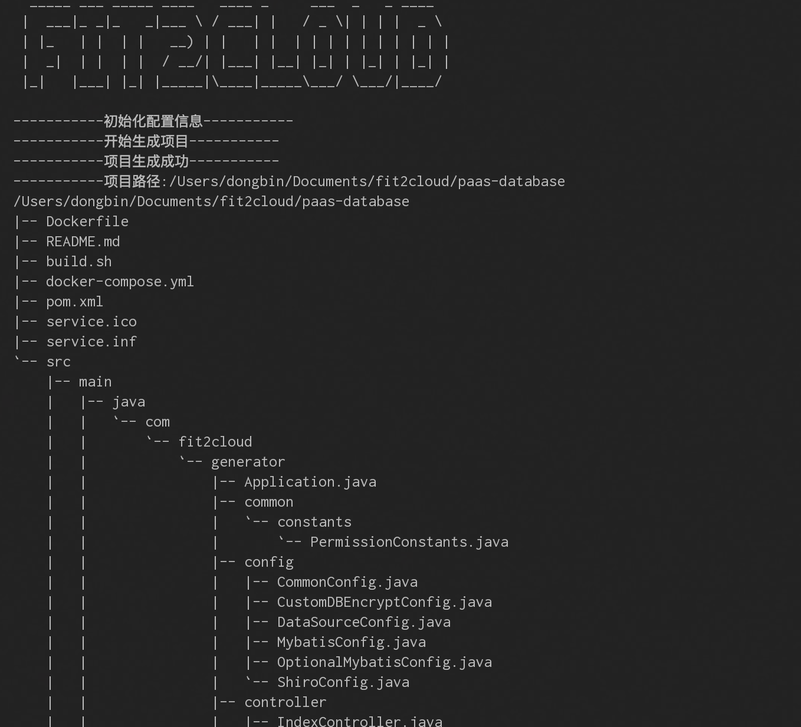

# FIT2CLOUD 2.0 扩展模块代码生成

- 使用
```bash
git clone https://github.com/dongbintop/fit2cloud2.0-generator.git
运行 `fit2cloud2.0-generator` 的 main 方法

```

- 参数配置
```bash
resource下的 config.properties

# application名称(小写)，默认fit2cloud2.0-demo
application.name=fit2cloud2.0-dongbin
# 模块名称，默认demo
module.name=数据开放平台
# 模块概览，默认${module.name}
module.summary=FIT2CLOUD 数据开放平台
# 模块顺序，默认20
module.order=20
# 模块端口，默认8080
module.port=6616
# 项目包名称，默认com.fit2cloud. 加上 ${module.name}最后一个单词
package=com.fit2cloud.dbaas.dongbin
# 默认 com.fit2cloud
groupId=com.fit2cloud
# 默认 2.0.0
version=2.0.0

```

- 生成截图




- docker 生成代码

```properties
修改 build.sh 的镜像地址

config.properties 文件 要挂载到容器的 /opt/generator 目录，并且项目生成的目录为容器/opt/generator
所以 docker run -v 本机目录:/opt/generator --rm 镜像地址

执行结束  项目在 /opt/generator/ 下

```


  
 


